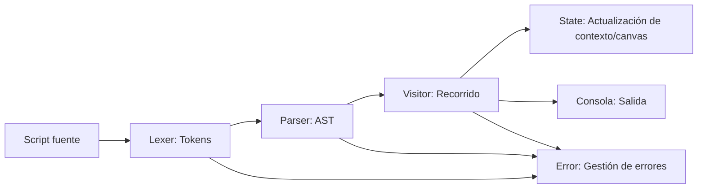

# Estructura Lógica del Proyecto PixelWall-E

PixelWall-E implementa un **motor de interpretación de scripts** para manipulación de imágenes y lógica personalizada sobre un lienzo de píxeles.  
La arquitectura separa claramente la interfaz de usuario (UI) de la lógica de interpretación y procesamiento, facilitando la extensión y el mantenimiento.

---

## 📁 Visión General del Backend (Lógica)

```plaintext
PixelWall-E/
│
├── Services/         <-- 💡 Núcleo lógico del proyecto
│    ├── AST/         <-- Definiciones del Árbol de Sintaxis Abstracta
│    ├── Error/       <-- Manejo y reporte de errores
│    ├── Lexer/       <-- Análisis léxico (tokenización)
│    ├── Parser/      <-- Análisis sintáctico (construcción del AST)
│    ├── State/       <-- Estado de ejecución y contexto
│    └── Visitor/     <-- Ejecución/interpretación del AST
│
├── Components/       <-- UI (Canvas, Editor)
├── Pages/            <-- UI (Home)
├── Layout/           <-- UI (MainLayout)
├── wwwroot/          <-- Recursos estáticos
└── ...               <-- Otros archivos de infraestructura
```

---

## 🔎 `/Services`

### 1. **AST/**  
**Propósito:**  
Define las clases/nodos para representar cada construcción del lenguaje interpretado.  
**Ejemplos de nodos:**
- Instrucciones (`AssignNode`, `CommandNode`, etc.)
- Expresiones (`BinaryOperationNode`, `LiteralNode`, `VariableNode`, etc.)
- Definiciones de funciones y bloques

**Uso:**  
El AST es la estructura intermedia generada por el parser y recorrida por el visitor para ejecutar el script.

---

### 2. **Lexer/**  
**Propósito:**  
Convierte el texto fuente en una secuencia de *tokens* (palabras clave, identificadores, números, operadores, etc).

**Componentes típicos:**
- Definición de tokens
- Mecanismo de avance y reconocimiento de patrones
- Detección y reporte de errores léxicos

**Ejemplo:**  
El código `n <- 5` se convierte en tokens como:  
`Identifier` `AssignArrow` `Number` 

---

### 3. **Parser/**  
**Propósito:**  
Recibe la secuencia de tokens del lexer y construye el AST.

**Responsabilidades:**
- Implementa reglas gramaticales del lenguaje
- Detecta y reporta errores de sintaxis
- Instancia los nodos definidos en `AST/`

**Ejemplo:**  
Reconoce una llamada a función, una asignación, un bucle, etc, y los representa como nodos en el AST.

---

### 4. **Visitor/**  
**Propósito:**  
Implementa el patrón *visitor* para recorrer y ejecutar el AST.

**Responsabilidades:**
- Evalúa expresiones y ejecuta instrucciones según su tipo de nodo
- Implementa la lógica de control de flujo (`GoTo`, `Assignament`, `Command`), llamadas a funciones, etc.
- Invoca métodos sobre el estado y comunica salidas a la consola/interfaz

**Ejemplo:**  
Para `Color`, modifica el color de la brocha en `State`.

---

### 5. **State/**  
**Propósito:**  
Mantiene el **contexto de ejecución**:

- Variables y sus valores
- Estado del canvas (píxeles, color actual, etc)
- Contextos (scopes de variables)

**Componentes:**
- Diccionarios/tablas hash para variables y funciones
- Métodos para manipular el canvas (setPixel, clear, setColor, etc)
- Métodos para comunicar con la consola o devolver resultados

---

### 6. **Error/**  
**Propósito:**  
Gestión centralizada de errores en todas las etapas:
- Léxicos (malformación de tokens)
- Sintácticos (errores de gramática)
- De ejecución (operaciones inválidas, referencias a variables inexistentes, etc)

---

## 🔄 Flujo de procesamiento típico

1. **Entrada:** El usuario escribe un script y lo ejecuta.
2. **Lexer:** Tokeniza el texto fuente.
3. **Parser:** Construye el AST.
4. **Visitor:** Recorre el AST, ejecutando cada instrucción y expresión.
5. **State:** El visitor consulta/modifica el contexto global, realiza operaciones sobre el canvas y variables.
6. **Error:** Cualquier problema en el proceso es gestionado y reportado al usuario.

---

## 🧩 Ejemplo visual del flujo



---

## 💡 Ventajas de esta arquitectura

- **Claridad y separación de responsabilidades:** Cada etapa está bien definida y desacoplada.
- **Extensible:** Se pueden agregar nuevas instrucciones, tipos de nodo o flujos de control fácilmente.
- **Robusta:** Los errores se gestionan de forma controlada y centralizada.

---

> **Nota:** Esta estructura permite que PixelWall-E evolucione fácilmente hacia soportar nuevos lenguajes, instrucciones o integraciones, manteniendo la lógica del intérprete separada de la interfaz de usuario.
