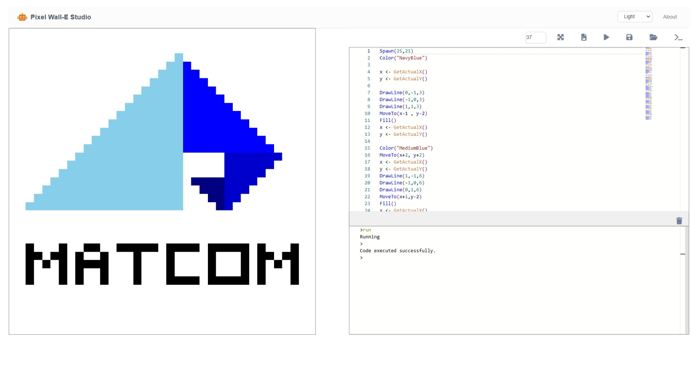
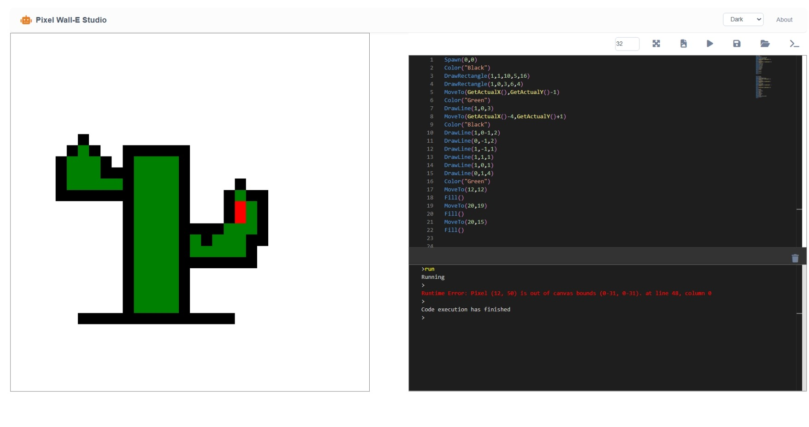

# ✨ PixelWall-E

PixelWall-E es una aplicación interactiva desarrollada en C# para la creación y manipulación visual de imágenes pixeladas, pensada como proyecto educativo para estudiantes de Ciencias de la Computación.

🔗 [Sitio web](https://pixel-wall-e-uqob.vercel.app/)
<!-- Si tienes un README_EN, agrega el enlace aquí -->

---

## 🚀 ¿Qué es PixelWall-E?

PixelWall-E permite experimentar con algoritmos gráficos y la manipulación de píxeles desde una interfaz visual sencilla. Es ideal para quienes desean aprender los principios básicos de gráficos por computadora y lógica de programación a través de la creatividad visual.

---

## 📌 Características principales

- Genera imágenes pixeladas a partir de instrucciones o interacción directa.
- Permite guardar las imágenes generadas.
- Paleta de colores ampliable con soporte para valores RGB en hexadecimal y decimal.
- Motor eficiente de matriz de píxeles para renderizado rápido.
- Interfaz intuitiva orientada al aprendizaje y la experimentación.
- Proyecto 100% open source bajo licencia MIT.

---

## 📥 Cómo empezar

Puedes usar PixelWall-E de dos maneras:

### 1️⃣ Usar la versión online

Accede directamente desde el navegador en  
👉 [https://pixel-wall-e-uqob.vercel.app/](https://pixel-wall-e-uqob.vercel.app/)

### 2️⃣ Clonar el repositorio

Si prefieres explorar el código fuente o contribuir:

```sh
git clone https://github.com/Edo-06/PixelWall-E.git
```

---

## 📖 Documentación

- Consulta la documentación de uso en la sección [About](/about) de la propia aplicación web.
- También puedes revisar la estructura técnica en el archivo [Struct.md](https://github.com/Edo-06/PixelWall-E/blob/main/Struct.md).

---

## 🖼️ Capturas de pantalla

<!-- Agrega aquí imágenes si las tienes -->



---

## 🤝 Cómo contribuir

¿Quieres ayudar a mejorar PixelWall-E? ¡Eres bienvenido!

Formas de aportar:

- Reportando bugs o errores
- Proponiendo nuevas funciones
- Mejorando la documentación
- Compartiendo ejemplos de uso propios

Haz tus sugerencias a través de issues o pull requests en este repositorio.

---

## 💬 Contacto

- **Autor:** [Edo-06](https://github.com/Edo-06)
- **Correo:** ailemamr04@gmail.com

---

## 📝 Licencia

Este proyecto está bajo la licencia MIT. Consulta el archivo [LICENSE](LICENSE) para más detalles.

---
